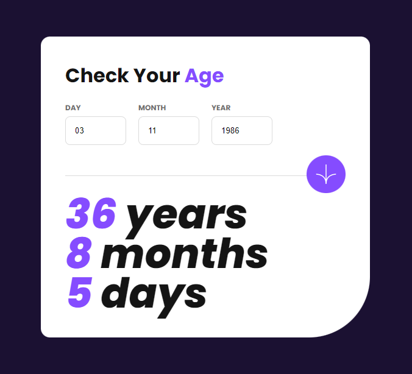
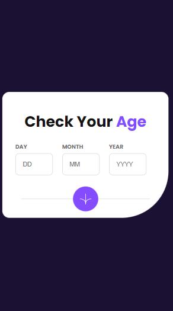

# Projeto Calculadora de idade

Esta é uma solução para o [Age calculator app](https://www.frontendmentor.io/challenges/age-calculator-app-dF9DFFpj-Q).

## Visão Geral

 

### O desafio -

Seu desafio é criar esse aplicativo de calculadora de idade e deixá-lo o mais próximo possível do design.

Seus usuários devem ser capazes de:

- Visualizar a idade em anos, meses e dias após enviar uma data válida por meio do formulário
- Receber erros de validação se:
  - Qualquer campo está vazio quando o formulário é enviado
  - O número do dia não está entre 1-31
  - O número do mês não está entre 1-12
  - O ano está no futuro
  - A data é inválida, por ex. 31/04/1991 (abril tem 30 dias)
- Veja o layout ideal para a interface, dependendo do tamanho da tela do dispositivo
- Veja os estados de foco e foco para todos os elementos interativos na página
- **Bônus**: veja os números de idade animados até o número final quando o formulário for enviado

 

### Tela Desktop

 

 

### Tela Mobile

 

 

## Ferramentas usadas

- HTML
- CSS
- JavaScript

 

## Links

https://osmarviana.github.io/age-calculator-app

 

# Autor

## Osmar Viana

 
  
   
  
   
  
   

